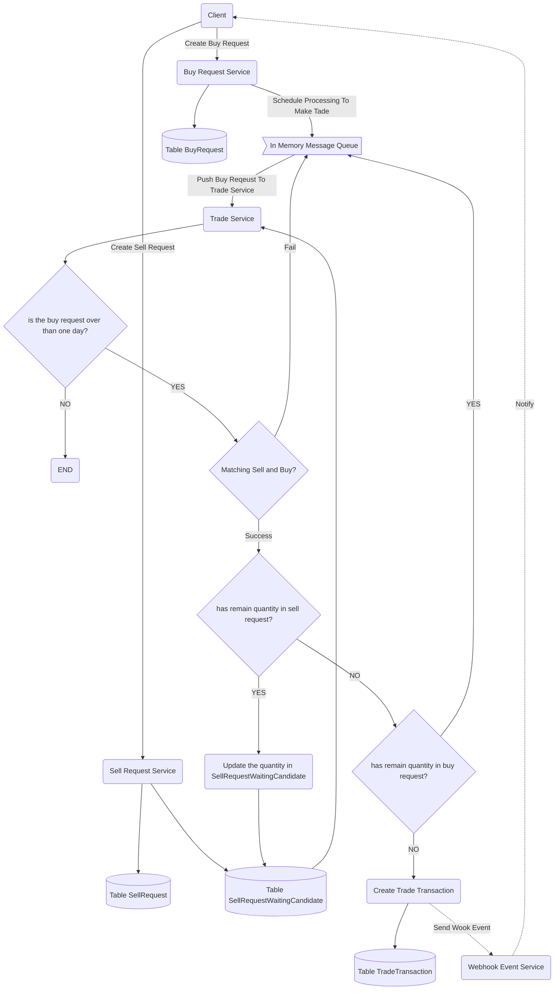

# zerologix-trade-engine

## [Interview] A trade engine for matching buy and sell.

---

### Summary

This is a trade engine for matching a buy request and a sell request with the same product and the requested amount. If it successfully makes a trade, the trade transaction record will be stored in table TradeTransaction.

##### Technoloy Tool

* Programming Language: **Java**
* Framework Library: **Spring Boot** & **Spring Data**
* DB: **Cassandra**(AWS Keyspaces)

### API

##### Buy Request API

A buy request represents a request of buying a product with requested amount and requested quantity. A client can create, get, or remove a buy request via the Buy Request API.

* POST /buy/request - Create a buy request
* GET /buy/request/:id - Get a buy request by request id
* DELETE /buy/request/:id - Delete a buy request by request id

##### Sell Request API

A sell request represents a request of selling a product with requested amount and requested quantity. A client can create, get, or remove a sell request via the Sell Request API.

* POST /sell/request - Create a sell request
* GET /sell/request/:id - Get a sell request by request id
* DELETE /sell/request/:id - Delete a sell request by request id

##### Trade Transaction API

A trade transaction represents a deal of trade. It contains product id, amount, quantity, and deal time. A client can get a trade transaction via the Trade Transaction API.

* GET /transaction/:id - Get a trade transaction by transaction id

### Trade Mechanism for Matching Sell and Buy

Successfully making a trade needs both a sell request and a buy request with the same product and amount. A created sell request would be stored in SellReqeust and SellRequestWaitingCandidate in Cassandra. In Table SellRequestWaitingCandidate, the product id and the requested amount are the partition key and the requested time is the cluster key which can be sorted. Therefore, the service can retrieve sell request data from the early sell reqeust with matching product id and requested amount.

On the other hand, a created buy request would be stored in BuyRequest and pushed into the message queue. Then, it waits in the message queue until it is polled out and makes a trade with the sell requests.

After successfully making a trade, it will generate a trade transaction which will be stored in the table TradeTransaction.

In the future, we can implement a webhook service. Once the trade transaction is created, it will send out a webhook event to both client who buys and who sells.

The following flow chart describes how to match a sell request and a buy request.

### Future Enhancement

1. Adds the command pattern design pattern to implement DB transactions. Once one of the steps fails, it can roll back the records.
3. Replaces the in-memory message queue with Kafka service.
4. Establishes a webhook service to notify the client that the trade transaction is made.
5. Establishes a customer service.
6. Establishes a product service.
